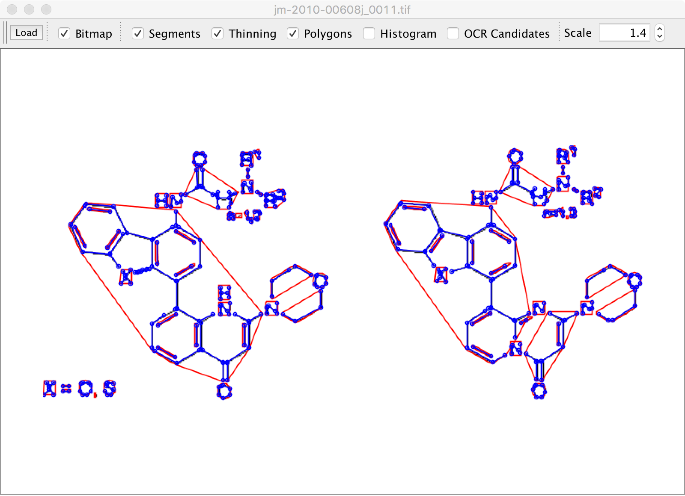

# MolVec
NCATS (chemical) ocr engine that can a way to vectorize
chemical images into Chemical objects preserving the 2D layout as much as 
possible. The code is still very raw in terms of utility. Check
out [https://molvec.ncats.io](https://molvec.ncats.io) for a
demonstration of MolVec. 

## Molvec is on Maven Central

The easiest way to start using Molvec is to include it as a dependency in your build tool of choice.
For Maven:

```
<dependency>
  <groupId>gov.nih.ncats</groupId>
  <artifactId>molvec</artifactId>
  <version>0.9.4</version>
</dependency>
```


## How To Build
   
   You can build the whole project as a jar file with:

   `$ mvn clean pacakge`

   Or install the project into your maven repository using:

   `$ mvn install`
   
## Example Usage
```java
    File image = ...
    String mol = Molvec.ocr(image);
```
    
## Async Support

  New in 0.8 MolVec supports asynchronous calls
 ```java
    CompleteableFuture<String> future = Molvec.ocrAsync( image);
    String mol = future.get(5, TimeUnit.SECONDS);
```
  
## Commandline interface
  The Molvec jar has a runnable Main class with the following options
  
    usage: molvec ([-gui],[[(-f <path> [-o <path>]) | (-dir <path> [-outDir <path>],[-parallel <count>])]],[-scale <value>],[-h])
    
    Image to Chemical Structure Extractor Analyzes the given image and tries to find the chemical structure drawn and
    convert it into a Mol format.
    
    options:
         -dir <path>         path to a directory of image files to process. Supported formats include png, jpeg, tiff. Each
                             image file found will be attempted to be processed. If -out or -outDir is not specified then
                             each processed mol will be put in the same directory and named $filename.molThis option or -f
                             is required if not using -gui
    
         -f,--file <path>    path of image file to process. Supported formats include png, jpeg, tiff.  This option or -dir
                             is required if not using -gui
    
         -gui                Run Molvec in GUI mode. file and scale option may be set to preload file
    
         -h,--help           print helptext
    
         -o,--out <path>     path of output processed mol. Only valid when not using gui mode. If not specified output is
                             sent to STDOUT
    
         -outDir <path>      path to output directory to put processed mol files. If this path does not exist it will e
                             created
    
         -parallel <count>   Number of images to process simultaneously, if not specified defaults to 1
    
         -scale <value>      scale of image to show in viewer (only valid if gui mode AND file are specified)
    
    Examples:
    
          $molvec -f /path/to/image.file
    
       parse the given image file and print out the structure mol to STDOUT
    
          $molvec -dir /path/to/directory
    
       serially parse all the image files inside the given directory and write out a new mol file for each image named
       $image.file.mol the new files will be put in the input directory
    
          $molvec -dir /path/to/directory -outDir /path/to/outputDir
    
       serially parse all the image files inside the given directory and write out a new mol file for each image named
       $image.file.mol the new files will be put in the directory specified by outDir
    
          $molvec -dir /path/to/directory -parallel 4
    
       parse in 4 concurrent parallel threads all the image files inside the given directory and write out a new mol file for
       each image named $image.file.mol the new files will be put in the directory specified by outDir
    
          $molvec -gui
    
       open the Molvec Graphical User interface without any image preloaded
    
          $molvec -gui -f /path/to/image.file
    
       open the Molvec Graphical User interface  with the given image file preloaded
    
          $molvec -gui -f /path/to/image.file -scale 2.0
    
       open the Molvec Graphical User interface  with the given image file preloaded zoomed in/out to the given scale
                       
### GUI
  Molvec Comes with a Swing Viewer you can use to step
  through each step of the structure recognition process


